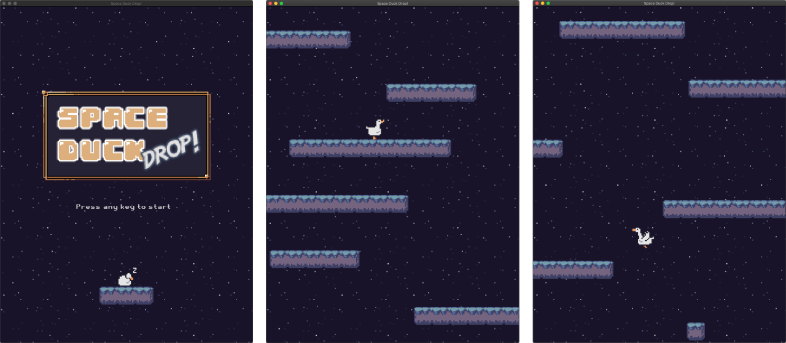

# Space Duck Drop!

A simple game made with pygame and self-made engine: [Geoko](https://github.com/conest/Gecko)

## 

## How to play

Use A & D key (or arrow key) to control the duck, and try to keep her stay in the screen. The game will be over if the duck get out of the screen.

## Getting Started

First you need install pygame

```bash
pip install pygame
```

Run the game

```bash
./run.sh
```

or directly

```bash
python3 ./src/main.py
```

A compiled version will be published later.

## Assets used in this game

Thanks the authors for their awesome work!

Duck sprite sheet
https://rascarcapack.itch.io/pixel-geese-anim-spritesheet

Space background
https://vectorpixelstar.itch.io/space

Platform sprite sheet
https://grafxkid.itch.io/cave-tileset

Retro_Gaming.ttf
https://www.dafont.com/bitmap.php